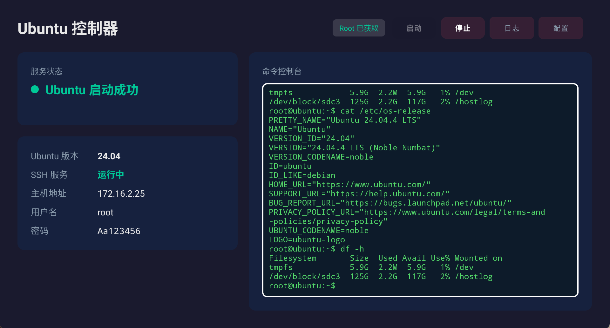
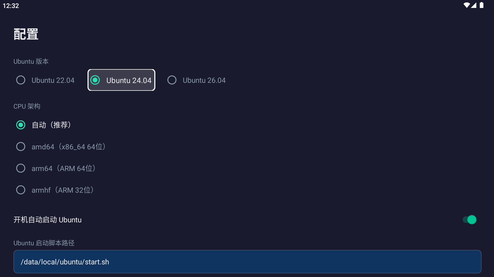

# 📺🐧 TVUbuntu — Run a Real Ubuntu on Your Android TV Box

<p align="center">
  <a href="README_zh-CN.md"></a>
  &nbsp;&nbsp;
  <a href="README.md"></a>
</p>

> Turn any Android TV box or Android device into a tiny, always-on **Ubuntu server**.
> A Kotlin Android **TV** app boots a genuine Ubuntu (22.04 / 24.04 / 26.04) via a native **chroot**, auto-installs **OpenSSH**, and shows the SSH connection info right on your living-room screen.

[](https://www.android.com/tv/)
[](https://kotlinlang.org/)
[-34A853)](https://developer.android.com/about/versions)
[](LICENSE)
[](https://github.com/jiyanlin7113-rgb/TVUbuntu/releases)

---

## 🌟 Why TVUbuntu?

Most TV boxes are **wasted silicon** — sitting idle, running ad-riddled launchers. TVUbuntu gives that hardware a second life as a **real Linux server**:

- 🐧 **A genuine Ubuntu userland**, not a container-emulated shell. Run `apt`, compile code, host services.
- 💻 **SSH in from your laptop** — it behaves like any other headless Ubuntu box on your LAN.
- 🔌 **Always-on, low-power** — a TV box draws ~2–3 W and can stay up 24/7 as a homelab node.
- 💰 **Recycle what you own** — no need to buy a Raspberry Pi or a VPS.

```
┌─────────────────────────┐         SSH (port 22)        ┌──────────────────────────┐
│   Your Laptop / PC      │ ───────────────────────────▶ │   Android TV Box (root)  │
│   $ ssh root@192.168.x.x│                              │  ┌──────────────────────┐ │
│                         │                              │  │ Ubuntu chroot        │ │
│                         │                              │  │  ├─ openssh-server   │ │
│                         │                              │  │  ├─ nginx / PHP / DB │ │
│                         │                              │  │  └─ your services    │ │
│                         │                              │  └──────────────────────┘ │
└─────────────────────────┘                              └──────────────────────────┘
        ▲                                                          │
        │            TVUbuntu App shows host / user / password     │
        └──────────────────────────────────────────────────────────┘
```

---

## ✨ Features

| Feature | Description |
| --- | --- |
| 🐧 **Native chroot (Root mode)** | In Root mode, uses the kernel-native `chroot` — no `proot` binary, lighter and faster. |
| 📡 **Auto rootfs download** | App downloads the minimal `ubuntu-base` tarball and decodes gzip on-device (avoids the box's `toybox tar` quirks). |
| 🔑 **Zero-config SSH** | Installs & launches `openssh-server`, then displays host / user / password / port on the TV. |
| 🎮 **TV-remote UI** | D-Pad navigation, focus-scaling "cursor" animation, large high-contrast buttons — built for a remote, not a touchscreen. |
| 🌐 **Multi-architecture** | `arm64` (real boxes), `amd64` (x86_64 emulators like MuMu), `armhf` (32-bit ARM). |
| 🔄 **Multi-version** | Ubuntu **22.04** (jammy) / **24.04** (noble) / **26.04** (resolute), isolated per version+arch. |
| ⚙️ **Boot auto-start** | Optional "start Ubuntu on boot" + launch-on-boot receiver. |
| 🛡️ **Robust shell layer** | `ShellExecutor` auto-detects `su` modes (interactive vs `su -c`), streams live progress, survives large output. |
| 🚀 **Production web stack** | One-shot `bootstrap_server.sh` spins up **nginx + PHP-FPM + MariaDB + Redis** under `supervisor`. |
| 🖥️ **Command console** | A built-in terminal card on the main screen streams live shell output (`cat /etc/os-release`, `df -h`, etc.) without leaving the TV. |
| 🌱 **No-root Proot mode** | No root? Run Ubuntu via `proot` instead — the same real Ubuntu userland, just without privileged ports (<1024) and systemd. Perfect for locked-down or unrooted boxes. |
| 📡 **Automatic ADB acquisition** | On app launch and on boot, silently obtains ADB access (wireless TLS pairing on Android 11+, classic TCP 5555 with an accessibility auto-click fallback) — the Proot-over-ADB path works with zero manual setup, no root required. |
| 🔧 **Proot on locked-down devices** | If the App's own process domain is blocked from executing proot (SELinux `EACCES`), it auto-falls back to launching proot through the device's `adbd` over the ADB protocol — runs on many more firmwares. |
| 🔌 **Custom ADB host & port** | Set your own ADB address/port. A toggle switches `adbd` to that endpoint `setprop service.adb.tcp.port` + `persist` + `ctl.restart adbd` on every app launch **and** boot, so your PC can always `adb connect` without re-enabling USB debugging. |

---

## 📸 Screenshots

<p align="center">
  
  <br/>
  <sub>Main UI — Ubuntu is running and SSH connection details are shown right on the TV.</sub>
</p>

<p align="center">
  
  <br/>
  <sub>Settings — choose Ubuntu version, CPU architecture, and enable boot auto-start.</sub>
</p>

---

## 🧱 Tech Stack

| Layer | Choice |
| --- | --- |
| Language | **Kotlin** |
| Build | Gradle 8.5 + Android Gradle Plugin 8.2.2 |
| Min / Target SDK | 21 (Android 5.0) / 34 (Android 14) |
| UI | Material Components + TV-adapted layouts (ViewBinding) |
| Concurrency | Kotlin Coroutines |
| Runtime model | Root `chroot` of `ubuntu-base` (no systemd inside) |
| Service mgmt | `supervisor` (inside Ubuntu) for the web stack |

---

## 📂 Directory Structure

```
TVUbuntu/
├── app/
│   ├── build.gradle.kts                 # App module: minSdk 21, version 1.5.2
│   ├── proguard-rules.pro
│   └── src/main/
│       ├── AndroidManifest.xml          # TV Leanback launcher + boot receiver + ADB accessibility service
│       ├── assets/
│       │   ├── start.sh                 # chroot bootstrap: mount, install SSH, run
│       │   ├── stop.sh                  # teardown: kill sshd, unmount
│       │   ├── start_proot.sh           # proot bootstrap (no-root)
│       │   ├── start_proot_adb.sh       # proot launched via adbd over ADB (locked-down firmwares)
│       │   └── adb_key.pem / adb_cert.pem / adb_key.pub   # baked ADB RSA key pair
│       ├── java/com/ubuntucontroller/
│       │   ├── MainActivity.kt          # TV UI: status, start/stop, SSH card, ADB state
│       │   ├── SettingsActivity.kt      # scripts / SSH / version / arch / ADB config
│       │   ├── UbuntuService.kt         # core logic: rootfs, arch, status, SSH info, ADB host/port
│       │   ├── ShellExecutor.kt         # root shell executor (su auto-detect)
│       │   ├── BootReceiver.kt          # auto-launch on device boot
│       │   ├── AdbClient.kt             # pure-Kotlin ADB client (CNXN/AUTH, RSA via AndroidKeyStore)
│       │   ├── AdbProotService.kt       # proot-over-ADB orchestration (key, push, launch, stop)
│       │   ├── AdbAutoAcquire.kt         # auto-acquire ADB on app launch & boot
│       │   ├── AdbAuthAutoClickService.kt / AdbAccessibilityHelper.kt  # auto-click USB-debug dialogs
│       │   ├── AdbNetworkEnabler.kt     # self-heal net ADB (setprop + restart adbd)
│       │   ├── UbuntuAdbManager.kt / AdbTransport.kt / AdbWirelessPairing.kt / AdbWirelessTransport.kt
│       │   ├── AdbKeyStore.kt           # ADB RSA key in AndroidKeyStore
│       │   └── TvFocusUtils.kt          # D-Pad focus helpers (TV cursor)
│       └── res/                         # layouts, drawables, strings, colors, themes, xml/
├── scripts/                             # gen_adb_pubkey.py / bake_adb_keys.sh (bake App pubkey into firmware)
├── bootstrap_server.sh                  # 🚀 production LEMP-ish stack in one shot
├── build.gradle.kts                     # root project
├── settings.gradle.kts
├── gradle.properties
├── gradlew / gradlew.bat                # Gradle wrapper scripts
└── AGENTS.md                            # project notes for AI agents
```

---

## ⚙️ How It Works

```
App (Kotlin, root)
   │  deployAssets()  → push start.sh / stop.sh to /data/local/ubuntu
   │  ensureRootfs()  → download ubuntu-base-<ver>-<arch>.tar.gz, gzip-decode on device
   ▼
start.sh  (run as root)
   ├─ mount proc/sys/dev/pts into rootfs
   ├─ fix toybox-tar symlinks / hardlinks / setuid bits
   ├─ chroot smoke-test (/bin/bash really runs)
   ├─ chroot → apt install openssh-server (+ curl/git/nano/sudo …)
   ├─ init root password once, enable PermitRootLogin + PasswordAuthentication
   └─ chroot → /usr/sbin/sshd -D -p <port>   (+ three-layer boot: /etc/rc.local → supervisord → /etc/init.d/*)
   ▼
MainActivity shows:  SSH host (device IP) · user · password · port
   ▼
You:  ssh root@<device-ip>   → a real Ubuntu shell 🎉
```

**Engineering highlights (the tricky bits we solved):**

- **Architecture detection that isn't fooled (fixed in 1.2.1).** Emulators like MuMu fake `uname -m` as `aarch64` while the real kernel is `x86_64`; TVUbuntu corrects to `amd64` **only** when the true arch is x86_64 yet `uname` lies. Genuine arm64 / armhf / x86 boxes keep their true arch, so Python/pip inside the chroot resolve the correct platform. Manual override remains available.
- **Three-layer service auto-start (new in 1.2.2).** On every boot `run_ubuntu.sh` launches services in order: (1) your custom `/etc/rc.local`, (2) `supervisord` if installed, (3) a generic `/etc/init.d/*` sweep that auto-discovers and starts any service with an init script — so anything you install (nginx, MySQL, Redis, Baota…) comes up on reboot without editing anything. Dangerous shutdown/mount scripts are skipped for safety.
- **`toybox tar` symlink repair.** Many boxes ship a `tar` that drops symlinks/hardlinks/setuid bits. We rebuild them from the tarball listing so `/bin/bash` and `/lib/ld-linux` resolve correctly.
- **App-side gzip decode.** The box `tar` often can't handle `-z`; the App decodes gzip in Java and passes a plain `.tar` to `tar -xf`.
- **Live progress over a pipe.** `start.sh` emits `UC_PROGRESS|<pct>|<msg>` lines that the App renders as a real progress bar.
- **Safe stop fallback.** If `stop.sh` is missing, the App force-stops via `pkill` + `umount`.

---

## 📥 Installation

### Option A — Sideload the APK (easiest)

1. The box **must be rooted** (Magisk / SuperSU / AOSP `su`).
2. Enable *Settings → Security → Unknown sources* (or the equivalent on your firmware).
3. Install:
   ```bash
   adb install TVUbuntu.apk
   # or copy the APK to the box and open it from a file manager
   ```
4. Open **Ubuntu Controller** from the TV launcher. Grant root when prompted.

> 💡 Grab the latest `TVUbuntu.apk` from the [Releases](https://github.com/jiyanlin7113-rgb/TVUbuntu/releases) page.

### Option B — Build from source

```bash
git clone https://github.com/jiyanlin7113-rgb/TVUbuntu.git
cd TVUbuntu
# Open in Android Studio (recommended), or:
gradle wrapper            # regenerate the Gradle wrapper if needed
./gradlew assembleRelease # → app/build/outputs/apk/release/app-release.apk
```

> 💡 The repo already ships the Gradle wrapper — just run `./gradlew assembleRelease` to build.
> If the wrapper is broken, regenerate it in Android Studio or grab the release APK.

---

## 🕹️ Usage

1. Launch the app on the TV. It detects root and shows the current status.
2. Press **Start Ubuntu**. First launch downloads the rootfs (~28 MB) and installs
   OpenSSH (~40 MB of packages) — this can take a few minutes. Subsequent starts are instant.
3. When status turns green, the **SSH card** shows:
   - **Host** — the box's LAN IP (WiFi preferred, eth0 fallback)
   - **User** — `root`
   - **Password** — default `Aa123456` (change it in Settings)
   - **Port** — `22` (configurable)
4. From your computer:
   ```bash
   ssh root@192.168.1.x      # password: Aa123456
   ```
5. To stop: press **Stop Ubuntu**.

---

## ⚙️ Settings

Open **Settings** on the main screen:

| Setting | Meaning |
| --- | --- |
| Ubuntu version | 22.04 / 24.04 / 26.04 |
| CPU architecture | auto / amd64 / arm64 / armhf (override auto-detection) |
| Runtime mode | Root (chroot) / Proot (no-root) |
| Start/Stop script path | default `/data/local/ubuntu/start.sh` & `stop.sh` |
| ADB host / port | the address & port the App uses for ADB (default `127.0.0.1:5555`) |
| Network ADB auto-start | toggle — on app launch & boot, switch `adbd` to the configured host:port |
| SSH port / user / password | connection credentials |
| Auto-start on boot | boot the box straight into Ubuntu |

---

## 🚀 Production Web Stack (optional)

Inside the running Ubuntu, drop in `bootstrap_server.sh` and run it to stand up a full
web stack managed by `supervisor` (no systemd in chroot):

```bash
# from your SSH session inside the box:
bash /root/bootstrap_server.sh
```

It installs & supervises: **nginx** (80) · **PHP-FPM** · **MariaDB** (3306) · **Redis** (6379),
plus common dev tools. Idempotent — safe to re-run.

```bash
supervisorctl status            # see all services
supervisorctl restart nginx     # restart one
mysql -u root                   # MariaDB (unix_socket auth)
```

---

## 🛠️ Troubleshooting

| Symptom | Fix |
| --- | --- |
| "Root denied" | Grant root to the app in Magisk/SuperSU. |
| Download fails | Confirm the box has internet; the App fetches from `cdimage.ubuntu.com`. |
| SSH not ready after start | Tap **Copy Log** and inspect `/data/local/ubuntu/ubuntu.log`. |
| `chroot` smoke-test fails | Usually SELinux; the script already tries `setenforce 0` + `chcon`. Check the log. |
| Emulator shows wrong arch | Set **CPU architecture = amd64** in Settings. |

---

## 📝 Changelog

### v1.5.2
- **Custom ADB host & port + persistent network ADB toggle.** The ADB host/port fields in Settings are now actually used: the old one-shot "Network ADB self-heal" button is replaced by a persistent **toggle**. When enabled, the App switches `adbd` to your configured host:port via `setprop service.adb.tcp.port <port>` + `setprop persist.adb.tcp.port <port>` + `ctl.restart adbd` on **every app launch and on boot** (in `MainActivity` and `AdbBootReceiver`), so your PC can always `adb connect <host>:<port>` without re-enabling USB debugging. The port is no longer hardcoded to 5555 — `AdbNetworkEnabler.enableViaRoot/enableViaAdb` now read the configured values, with `enable()` as a one-call Root-then-ADB helper.

### v1.5.1
- **Broader device compatibility for Proot — automatic ADB fallback path.** On locked-down firmwares where TVUbuntu's own process domain is blocked from executing proot (SELinux `EACCES` on `app_data_file`), the App now auto-detects the failure and falls back to launching proot through the device's own `adbd` (shell domain) over the ADB protocol. proot binaries/rootfs land in `/data/local/tmp/ubuntu/` (shell-writable/executable), so many more boxes that previously failed outright can now run Ubuntu.
- **Automatic ADB acquisition.** On app launch and on boot, TVUbuntu transparently obtains ADB access — wireless TLS pairing on Android 11+ (no prompt), classic TCP 5555 with an accessibility auto-click fallback for older devices — so the Proot-over-ADB path "just works" without root.
- Added a pure-Kotlin ADB client (`AdbClient.kt`), `AdbProotService.kt` orchestration, `start_proot_adb.sh`, baked-pubkey tooling (`scripts/`), and ADB host/port preferences. Status / stop / console / log now route correctly through either the direct or the ADB path.

### v1.4.4
- **Settings page cleanup (per the user's three improvements):**
  1. **ADB auto-acquire (on app launch / boot) is now on by default** → removed the toggle UI from Settings; it stays always-on with no user interaction needed (the underlying `AdbAutoAcquire` default `true` is unchanged, only the UI was removed).
  2. **Removed the "Show local ADB public key" button and `showAdbPubkey()`** — the public key needs root to write to `/data/misc/adb/adb_keys`, but if you already have root you take the other root path, which is a paradox, so it was dropped outright; the underlying `ensureKey`/`exportPubkey` are kept because the ADB connection internally still depends on them.
  3. **Initial focus in Settings now lands on the "Enable ADB auth auto-click" button (`btnAdbAutoClick`)**, making it easy for remote-control users to enable the accessibility auto-click directly.
  - Also cleaned up `strings.xml` (7 `adb_pubkey_*` entries + 2 `adb_auto_acquire_*`), `activity_settings.xml` (removed the ADB pubkey block and the auto-acquire toggle block, reconnected the focus chain `btnAdbAutoClick ⇄ btnEnableNetAdb ⇄ etAdbHost`), and `SettingsActivity.kt` (removed related listeners/imports/methods).
- **Version bump** to `1.4.4` (versionCode 13 → 14). `clean assembleDebug` full build BUILD SUCCESSFUL (only unrelated historical warnings remain: deprecated `recycle()`, parameter naming, unused params).

### v1.4.3
- **Fully removed Shizuku integration (per the user's "don't show, don't integrate" request):**
  - Deleted `ShizukuBridge.kt` (a zero-dependency reflection bridge that was always in a dormant "not integrated" state, only causing confusion in the status line).
  - `AdbNetworkEnabler` removed `enableViaShizuku`; `AdbAutoAcquire` / `AdbProotService` self-heal calls dropped the Shizuku branch, keeping only the **Root + authorized adb** two privileged sources.
  - `SettingsActivity` removed the Shizuku status line, the "Authorize Shizuku" button, its `openShizuku()` method and import.
  - `activity_settings.xml` deleted the Shizuku block and reconnected the focus chain (`btnEnableNetAdb ⇄ etAdbHost`).
  - `strings.xml` removed 4 `adb_shizuku_*` entries and cleaned up the `adb_net_adb_hint` text; `build.gradle.kts` / `settings.gradle.kts` / `AndroidManifest.xml` removed Shizuku dependencies, the rikka repo, permissions and provider comments.
  - Reason: boxes work fine with the root / baked-pubkey 5555 / classic ADB popup trio, and Shizuku only makes sense for phones/tablets without root or wireless debugging, and would cause "not integrated" status confusion; the user confirmed the channel is no longer needed.
- **Version bump** to `1.4.3` (versionCode 12 → 13). Debug + Release both BUILD SUCCESSFUL.

### v1.4.2
- **Three-tier progressive ADB acquisition for no-root devices (per the user's explicit flow):**
  1. Open the App (no root and "ADB auto-acquire" on) → `AdbAutoAcquire` auto-acquires ADB;
  2. Auto-acquire fails → the ADB button shows red "No ADB", user taps to retry manually (`requestAdbAuth`);
  3. Manual tap still can't connect (adbd unreachable / too old, i.e. `UNREACHABLE`/`ERROR`) → **auto-pop the wireless pairing dialog** (Android 11+); older versions (no wireless debugging) get a guide to enable "Network ADB debugging" or "ADB auth auto-click".
- **Removed the main-screen "Wireless pairing" button:** it is now auto-popped by tier 3, focus chain reconnected (`btnAdb` adjacent to `btnStart`).
- **Wireless pairing dialog restyled to match Settings:** `pairing_dialog.xml` root background `bg_primary`, label `text_secondary`, input `@drawable/bg_input` (`text_primary`/16sp/52dp/16dp padding), buttons `btn_secondary`/`btn_start` (16sp/52dp), with an embedded custom title (`text_primary` 20sp bold), and the dialog window background set to `bg_primary`.
- **Pairing address/port pre-filled `127.0.0.1:5555`** (default classic network ADB), still editable; "auto-discover" still overrides it.
- **Version bump** to `1.4.2` (versionCode 11 → 12). Debug + Release both BUILD SUCCESSFUL.

### v1.4.1
- **Reversed the launch priority for no-root devices (per the user's explicit flow):** previously it was "local proot first → fall back to ADB only if SELinux blocks"; now it is **"have root → root mode; no root → acquire ADB first, and if ADB works launch Ubuntu over ADB; only fall back to local proot if ADB acquisition fails"**, consistent with the user's overall goal (ADB auth is just a means, the end is to launch Ubuntu).
  - **`AdbProotService.acquireTransportForLaunch(context): AdbTransport?`:** new synchronous transport method reused directly by the launch flow — includes ① try to enable accessibility auto-click as much as possible, ② Android 11+ wireless TLS pairing direct connect (no popup) first, ③ if classic 5555 unreachable, self-heal via `AdbNetworkEnabler` then authenticate, ④ on successful auth persist 5555. Non-null means authorized and usable, null means acquisition failed.
  - **`ProotUbuntuService.startUbuntu` now ADB-first:** when no root and "ADB auto-acquire" is on, first `acquireTransportForLaunch` → `launchViaTransport` to push and keep proot+SSH resident over ADB; if transport acquired but launch fails, or acquisition fails, fall back to local proot. Removed the original "switch to ADB only if SELinux blocks" fallback (since ADB is now first).
  - **Toggle linkage:** controlled by `AdbAutoAcquire.isEnabled(context)` (default on). When off, go straight to local proot, no ADB attempt.
- **Version bump** to `1.4.1` (versionCode 10 → 11). Debug + Release both BUILD SUCCESSFUL.

### v1.4.0
- **ADB auto-acquire (on app launch / boot) — closing the gap with the app manager's "control":** the user scope expanded from Allwinner/H618 boxes to phones and tablets, requiring ADB to auto-acquire on app open/boot, and completing the app manager's other control capabilities.
  - **New `AdbAutoAcquire` unified orchestrator:** triggered on app open (`MainActivity`) and boot (`AdbBootReceiver` → `BOOT_COMPLETED`). Sequence: ① try `WRITE_SECURE_SETTINGS` to enable accessibility auto-click directly; ② Android 11+ prefers wireless TLS pairing (no popup, connect on screen unlock); ③ if classic 5555 unreachable, first "network ADB self-heal" then authenticate; ④ after classic-channel auth success, persist 5555 (`persist.*`) for next auto-connect. The first manual auth is normal.
  - **New `AdbNetworkEnabler` network ADB self-heal:** when a privileged shell is obtained (authorized adb / Root / Shizuku), `setprop service.adb.tcp.port 5555` + `persist.adb.tcp.port 5555` + `ctl.restart adbd` (aligns with app manager `ba/u.java:221`).
  - **New `ShizukuBridge` phone/tablet fallback channel (zero-dependency reflection):** does not reference `rikka.shizuku.Shizuku` at compile time, so it builds by default; after the user uncomments `rikka.shizuku:api`/`:provider` in `build.gradle.kts` + `maven.rikka.app` in `settings.gradle.kts` + installs the Shizuku app, `isAvailable()/exec()/requestPermissionWithListener()` call the real API via reflection, providing an adb-popup-free privileged shell (this sandbox has no `maven.rikka.app`, so the dependency is disabled by default).
  - **New `AdbBootReceiver`:** after `BOOT_COMPLETED`, auto-acquire ADB in the background (does not launch Ubuntu), decoupled from "launch on app start"; only triggered when no root and the toggle is on.
  - **Settings page additions:** "ADB auto-acquire (on app/boot)" toggle, "Network ADB self-heal" button, Shizuku status and "Authorize Shizuku" button.
  - **Manifest:** added `RECEIVE_BOOT_COMPLETED` permission + `AdbBootReceiver` receiver + `moe.shizuku.manager.permission.API_V23` permission (Shizuku provider comment placeholder, uncomment after enabling dependency).
- **Version bump** to `1.4.0` (versionCode 9 → 10). Debug + Release both BUILD SUCCESSFUL.

### v1.3.2
- **Added the ADB dual-channel (aligning with the app manager):** the app manager is not popup-free the whole time — it also has a "classic network ADB (TCP 5555, RSA handshake)" fallback channel, using the `AccService` accessibility service to auto-click away the "Allow USB debugging" system popup. TVUbuntu previously only implemented Android 11+ wireless debugging TLS pairing (no popup), which would stall on boxes below Android 11 / without pairing code (e.g. H618, Allwinner). Now added:
  - **New `AdbAuthAutoClickService` (accessibility service):** listens for window changes, matches popups from `com.android.systemui` / `com.android.settings` containing "USB debugging / wireless debugging / OTG / USB device" keywords, and auto-clicks "Allow". Conservative matching, won't mis-click other popups. Config in `res/xml/adb_auth_accessibility.xml`.
  - **Settings "ADB auth auto-click" toggle:** prefers `WRITE_SECURE_SETTINGS` to enable directly, falls back to jumping to system accessibility settings for manual enable.
  - **Classic 5555 channel fallback:** `AdbProotService` automatically takes the classic TCP handshake when wireless pairing is unavailable (Android < 11 or `AdbPairingRequiredException`), and the popup is auto-authorized by the accessibility service (`AdbClient` already sent `AUTH_PUBKEY` to trigger it).
  - **Firmware-baked pubkey script:** `scripts/gen_adb_pubkey.py` generates `assets/adb_key.pub` (adb_keys format, consistent with the runtime algorithm), `scripts/bake_adb_keys.sh` writes to `/data/misc/adb/adb_keys` and `/adb_keys` and fixes permission/SELinux. After baking, the classic channel is popup-free and needs no accessibility permission.
- **Version bump** to `1.3.2` (versionCode 8 → 9).

### v1.3.1
- **Version bump** to `1.3.1` (versionCode 5 → 8); prior minor iterations had not kept versionCode in sync.
- **Wireless debugging popup-free pairing (Proot/ADB channel):** new "Wireless pairing" button and support library `muntashirakon/adb` (libadb-android 3.1.1). Flow: mDNS discovers `_adb-tls-pairing` → enter 6-digit pairing code to silently authorize the local pubkey (written to device `adb_keys`, **no "Allow USB debugging" popup**) → establish a TLS long-lived connection via `_adb-tls-connect`. On screen unlock, if already paired it auto-connects via TLS. Private key and self-signed cert are built into `assets/adb_key.pem` + `adb_cert.pem` (same RSA 2048 key, constant pubkey, the old "bake into firmware" scheme still works). The classic 5555 plaintext channel is kept as a fallback.
- **Low-port note (Proot mode):** Proot mode runs *unprivileged* — Android restricts non-root processes to binding ports **≥ 1024** (`net.ipv4.ip_unprivileged_port_start=1024`). So nginx/Baota (aaPanel) listening on `888` fails with `bind() to 0.0.0.0:888 failed (13: Permission denied)` — that is an Android kernel limit, **not** an app-level port block (the app's own SSH daemon uses 8022 for this reason). Fix: use a port ≥ 1024 (e.g. `listen 8088`) or run in Root mode.
- **Arch & Android version coverage confirmed:** detection uses `getprop ro.product.cpu.abilist` + `uname -m` (handles x86_64, MuMu faked-aarch64 correction, aarch64, armv7/armv8); `minSdk 21` (Android 5.0) + `targetSdk 34` (Android 14); all three ABI libproot.so already carry the empty-path fix — emulator and real device behave the same.

### v1.2.3
- **Built-in command console.** The main screen now includes a live command terminal card. It streams shell output directly on the TV, so you can run quick checks like `cat /etc/os-release` or `df -h` without opening an SSH client.
- **Bug fixes and stability improvements.** Polished edge cases in the shell executor and startup flow.

### v1.2.2
- **Three-layer service auto-start.** `run_ubuntu.sh` now runs services in order on every boot: `/etc/rc.local` (your custom commands, kept for backward compatibility) → `supervisord` (if installed) → a generic `/etc/init.d/*` sweep that auto-discovers and starts any service exposing an init script. New services boot automatically on reboot with zero config changes; dangerous system scripts (halt/reboot/mount/…) are skipped for safety.

### v1.2.1
- **Fixed real-environment architecture detection.** `rootfsArch()` now treats `uname -m` as the baseline and overrides to `amd64` **only** when the true arch is x86_64 but `uname` was spoofed (e.g. MuMu emulator masking itself as `aarch64`). Genuine arm64 / armhf / x86 devices keep their true architecture, so Python/pip inside the chroot read the correct value.

---

## 📜 License

[MIT](LICENSE) © 2026 Jiyan Daxia / jiyanlin7113-rgb. Free for personal and commercial use.
Note: running a chroot requires root and is at your own risk — it may void warranties
and can brick misconfigured devices.

---

## ☕ Like it?

If TVUbuntu gave your old TV box a new life, **⭐ star the repo** and share it!
Pull requests and issue reports are very welcome. 🐧
